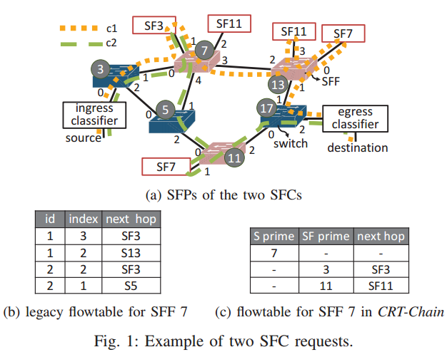
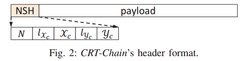
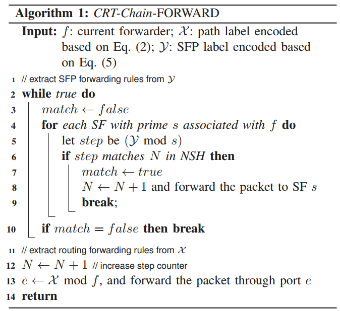
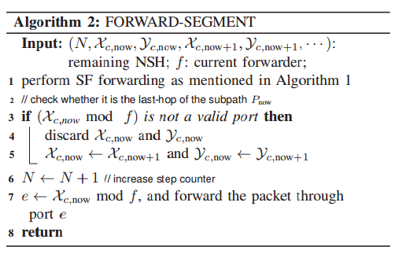

#On Scalable Service Funciton Chaining with O(1) Flowtable Entries
@INFOCOM'18
[TOC]
##1. Backgroud and Motivation
- Motivation
NFV offers customization capability. it howerver comes with a cost of consuming precious TCAM resources.
  > The number of service chains that an SDN can support is **limited by the flowtable size of a switch**.
  > The **scalability** is a fundamental challenge of enabling such configurable service chaining.

- The core of CRT-Chain is an encoding mechanism that leverages **Chinese Reminder Theorem (CRT)** to compress the forwarding information into small labels. 

- VNFs can be efficiently scaled up/down and, hence, provide agility and flexibility to adaptation of network components according to dynamic user demands.

- SDN is able to deliver **elastic services** so that  allows traffic to go through a customized sequence of services.

##2. Technical Challenges
1. The **ambiguity** in forwarding
An SFC may request ti be served by different funcitons associated with the same switch in *a specific order*.

2. How to reduce the label size?
Propose <u>a chain segmentation scheme</u> that allows the overall label size of all the segments to be smaller than the label size of **end-to-end** path.

3. A CRT label size is determined by the primes assigned to the functiuons along a chain. 
It exploits a prime assignment strategy based on the distribution of function popularity to reduce the expected label size.

##3. Related Work
主要讨论了三个方面的工作：
- Flowtable Management
- Entry Size Reduction
- Flowtable-Free Routing

##4. The Model of SFC
- The SFC protocol defined in **IETF RFC7665**
1. To improve reliability and load-balancing, for each Service Function (SF), it can have multiple instances, associated with a different Service Function Forwarder (SFF).

2. An SFF can insert/process the forwarding rules generated for an SFC and can further know how to parse the **Network Service Header (NSH)** of an SFC packet.

two SFC requests: $c_1$, $c_2$
$c_1$: $SF3 \rightarrow SF11 \rightarrow SF7$
$c_2$: $SF3 \rightarrow SF7$

3. Each SF instance along the SFP decreases the value of SI by 1 such that all the SFFs can know whether an SFC has been executed completely.

4. **The problem**: the number of the required flowtable entries grows **linearly** with the number of SFC requests. (*to distinct SFC*)

##5. CRT-Chain Design
###5.1 Overview of CRT-Chain
Goal: to resolve the scalability issue.
- High-level Idea of CRT-Chain: replace **per-chain** forwarding rules with **per-function** forwarding rules.
  > For all the chains requesting to be served by an SF instance, it associated SFF inserts **only one forwarding rule** for this SF instance. (regardless of how many chains assigned to it)

An SFF then uses vey simple modular arithmetic to extract the forwarding information directly from the labels, **without knowing which chain it belongs to**. 

- CRT-Chain only requires **a constant number** of flowtable entries in each SFF.
- CRT-Chain transfers <u>the cost of flowtable entries to the label overhead</u>

###5.2 CRT-based Chaining
- Notation:
$F$: the set of SFF or switches
$S$: the set of available SF types
$C$: the set of SFC requests, $c \in C$ 
$P(c)$: the routing path of $c$
$SP(c)$: the SFP of $c$

For example: 
$P(c1) = IC \rightarrow S3 \rightarrow SFF7 \rightarrow SFF13 \rightarrow S17 \rightarrow EC$
$SP(c1) = SF3(SFF7) \rightarrow SF11(SFF13) \rightarrow SF7(SFF13)$

- In its design, it encodes $P(c)$ and $SP(c)$ of each $c \in C$ into **two variable length labels**, $X_c$ and $Y_c$ (用两个不同的label)

1. Each forwarder decodes $X_c$ and $Y_c$ to extract the forwarding rules for routing and SFP.
2. The length of the fields $X_c$ and $Y_c$ can be set to $log_2|X_{max}|$ and $log_2|Y_{max}|$ 

- Assign each forwarder in $F$ a **unique** prime, and, similarly, assign each SF type in $S$ a **unique** prime.  (as the ID of the forwarder (SF)), a forwarder and an SF can share **same prime**.
  > $f \neq f'$ for all, $f, f' \in F$
  > $s \neq s'$ for all, $s, s' \in S$. The number of required SF primes is determined by the number of SF types $|S|$, instead of the number of SF instances.
  > $f = s$ for any $f \in F$, $s \in S$ is allowed 

- **Encoding and decoding $X_c$**
Given a path $P(c)$, the path label $X_c$ should satisfy the following constraints:
$X_c = e_i(mod f_i(c)), \forall 1\leq i \leq |P(c)|$ （用余数表示端口号）
  > $f_i(c)$ is the prime assigned to the i-th forwarder along the path $P(c)$

According to CRT, the solution of $X_c$ can be found as follows:
  > $X_c = (\sum_{i=1}^{n}(w_i \times e_i))$(mod $X)$ (利用同余方程解的公式), $X = \prod_{i=1}^{|P(c)|}f_i$

For example, for a given service function chain $c_1$, which traverses through forwarders with primes 3, 7, 13 and 17 using the output ports 1, 3, 1 and 2 respectively. Hence, the path label $X_{c1}$ should meet the following constraints:
>$X_{c1}$ = 1(mod 3)
>$X_{c1}$ = 3(mod 7)
>$X_{c1}$ = 1(mod 13)
>$X_{c1}$ = 2(mod 17)

get $X_{c1} = 4,252$

The maximum possible label $X_{max}$, can can be found by the largest primes. (考虑了解的最大值的问题) 
To forward an SFC packet, each forwarder decodes $X_c$ and extracts the forwarding port by using its assigned prime, $e_i = X_c$ mod $f_i(c)$ (Forwarder通过计算得到转发所用的端口)

- **Encoding and decoding $Y_c$**
1. The **difference** between SFP label $Y_c$ and path label $X_c$
an SFF might associate with multiple SF instances and, more inportantly, the order of forwarding to different SF instances matters.

How to overcome this problem?
it introduce **a step counter $N$** for each SFC packet

For example: 
c:$SF3 \rightarrow SF11 \rightarrow SF7$
>$Y_c$ = 1(mod 3) 
>$Y_c$ = 2(mod 11)
>$Y_c$ = 3(mod 7)

In Step1: if $Y_c$ mod 3 = 1, then it means SFF forwards to SF3 in $step1$, then SF3 instance adds the step counter $N$ by 1.（用余数表示顺序）

If current associated SF instances do not match the current step counter, then SFF sends it out.

- Ensuring unique SFP forwarding (考虑了唯一性的问题，上述的简单encoding的方法不一定通用 )
1. This simple CRT encoding cannot guarantee **correct SFP scheduled** by the controller.  (e.g. 比如一种SF多个实例的情况，在这种情况下，会出现异常的转发行为)

2. To avoid this ambiguity, it combines all the forwarders along $P(c)$ and all the SF instances along $SP(c)$ into a **merged path $MP(c)$** in their traversing order.

	.g. $MP(c) = (1)S3 \rightarrow (2)SFF7 \rightarrow (3)SF3 \rightarrow (4)SFF13 \rightarrow (5)SF11 \rightarrow (6)SF7 \rightarrow (7)S17$ 		(将每个step所对应的device也编入在序列中)

CRT-Chain now encodes the SFP label $Y_c$ using **the step counts in $MP(c)$**, rather than the original step counts in $SP(c)$, thus, $Y_c$ should now statisfy the following constraints:
$Y_c = ix_n($mod $s_n(c))$, $\forall 1 \leq n \leq |SP(c)|$
$ix_n$ denotes the step count (index) of $s_n(c)$ in **the merged path MP(c)**

###5.3 Chain Segmentation
**Problme**:
The header overhead, i.e., $|X_c|$ and $|Y_C|$ is determined by the primes used in the congruence system.
> e.g., larger primes lead to larger labels, $X_c$ and $Y_c$. (the header size scales up with the number of forwarders [SF types] in a network)

- An intutive solution (从减少primes的角度)
To allow different forwarders (SFs) to use the same prime, as a result minimizing the number of primes.

Given $F(S)$, instead of using $|F|(|S|)$ unique primes, it can use only $\alpha |F|$ $(0 \leq \alpha \leq 1)$ 

**It poses a new problem**: 
When some forwarders (SFs) share the same prime, there will be problem if they happen to belong to the same path (SFP)

To avoid this problem: it proposes a **segmentation technique** that partitions a path (SFP) into several sub-paths *(in each which any two forwarders (SFs) do not share the same prime)*

- Partitioning a path: (思想很简单 )
1. Trace the path and check whether any $f \in P(c), (s \in SP(c))$ has a prime duplicated with any one locating prior to it.

2. For any duplicated prime found, the path should be cut here, making those forwarders (SFs) prior to it as **a conflict-free sub-path**.

For example: 
Consider an example path:
$P(c) = f_1 \rightarrow f_2 \rightarrow f_3 \rightarrow f_4 \rightarrow f_5$
assigned the primes:
$5 \rightarrow 13 \rightarrow 5 \rightarrow 2 \rightarrow 7$
It should be partitioned into two conflict-free sub-paths:
$P_1(c) = f_1 \rightarrow f_2 = 5 \rightarrow 13$
$P_2(c) = f_3 \rightarrow f_4 \rightarrow f_5 = 5 \rightarrow 2 \rightarrow 7$
Those sub-labels are then conncatenated together as the header in the format of 
$(N, l_{X_{c, 1}}, X_{c, 1}, l_{Y_{c, 1}}, Y_{c, 1}, ...)$

- Forwarding sub-paths:
The remaining problem is how can a forwarder know which sub-label $(X_{c, i}, Y_{c, i})$ it should decode and when should a sub-label be discarded.

Its design is motivated by an observation that **each forwarder has a limited number of output ports**.
> Hence, it can use this parameter to encode the termination rule of a sub-path

let $o_f$ denote the maximum output port of forwarder $f$, the remainder $e_{null}$ can be any integer number larger than the maximum output port $o_f$
$X_{c, i} = e_{null}$ (mod f),

By doing this, the last-hop forwarder $f$ of a sub-path will get an invalid port $e_{null}$ and easily detect that it should end the current sub-path. **Then, the forwarder drops the current sub-label $(X_{c, i}, Y_{c, i})$**, extracts the next one $(X_{c, i}, Y_{c, i})$.

- Prime Assignment
It can further reduce the header overhead by **decreasing the probability of using those large primes**
> many paths going through those <u>popular SFs with large primes can output large labels.</u>

**solution**: assign primes to forwarders and SFs according to their **popularity (or loading)**
1. Assign small primes to *heavy loaded forwarders and popular SF types*, while letting less used ones have *large primes*. 

2. **popularity score**: count the number of chains that traverse through a forwarder $f \in F$ (SF $s \in S$), denoted by the **popularity score** $w_f (w_s)$, and sort $f \in F$ ($s \in S$) in <u>descending order of their popularity $w_f (w_s)$</u>

##6. Implementation and Experiment
a network accommodates 64 VMs and hence is capable of supporting 64 SF instances in total.
- Impact of the Number of SFC Requests (测试scalability)
- Impact of the Length of SFCs
- Impact of Prime Reuse and Path Segmentation
- Impact of the Number of SF Types
- Impact of Segmentation on Bandwidth Consumption
- Overall Overhead