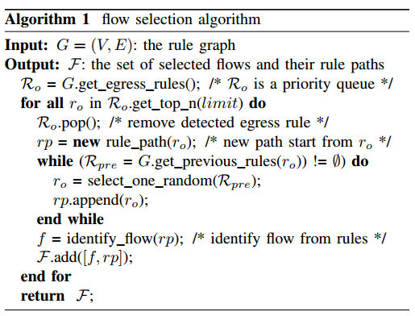
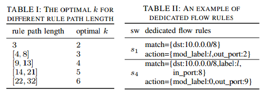
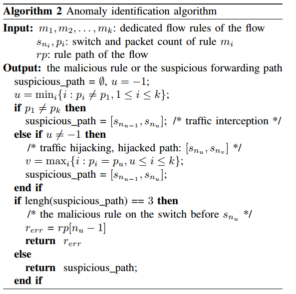

# FADE: Detecting Forwarding Anomaly in Software Defined Network
@IEEE ICC 2016

[TOC]

## Motivation
- Flow rules installed in switches can be easily tempered by different entities intentionally or unintentionally.

- Forwarding Anomalies are normally triggered by **equipment failure** and **network attacks**.
- Flow rules enforced at the data plane <u>may not be same with</u> the flow rules installed by the control plane 

- Forwarding Anomaly Detection (FAD) in SDN is always achieved by sending probing packets or analyzing flow statistics. These approaches are not **effective** and **efficient**. 
  e.g. 
  > 1. high communication overheads
  > 2. cannot capture all attacks

##Problem Statement
- This paper define network flow as a set of packets processd by the same sequence of flow rules.
- Normally, forwarding anomalies can be classified into two categories, 
  > 1. traffic interception attacks: flow are dropped or forwarded to wrong rule paths that **never return** to their correct rule paths
  > 2. traffic hijacking attacks

##Challenge 
1. Flow Selection: select a minimal set of flows in the rule graph so that their rule paths can cover all rules paths. (**Flow Selection Algorithm**)
2. Rule Generation
3. Traffic Aggregation and Traffic Burst: Anomaly identification should accurately collect flow statistics and verify them <u>under traffic burst and traffic aggregation</u>. (**Using Label**)

##Solution
**Basic Idea**: flow rules forwarding the same flow should have consistent view on the flow's statistics. 
There are three steps in FADE:
- Firstly, FADE builds a **rule graph** according to topology and flow rules. And it uses a flow selection algorithm to select a small set of flows whose rules path can cover all existing rule paths in the rule graph.
- Secondly, FADE generates dedicated flow rules for every selected flow and installed them in the data plane to track the flows.
- Thirdly, FADE collects flow statistics to identify if there is any forwarding anomaly.

- Flow Selection: For each egress rule, flow selection traverses the rule graph **reversely** to find a rule that has an indegree of 0 in the rule graph, i.e., ingress rule.
  > As the case of traffic aggregation that a rule may have multiple previous rules in the rule graph. Thus, the rule graph is constructed as a forest. In the forest, the roots of trees are egress rules and leaves are ingress rules.
  

- Rule Generation: FADE generates several dedicated flow rules to collect their flow statistics and computers the set of switches on which these dedicated flow rules should be installed. FADE supposes it;s a **bijection** between flow rules in  a rule graph. 
  > e.g. ${r_{11}, r_{31}, r_{41}}$ is ${S_1, S_3, S_4}$
- It generates k (k>2) dedicated flow rules for each selected flow, and installs them to the first switch, k-2 intermediate switches and the last switch on the flow's forwarding path.

- Once a dedicated flow rule is installed on the switch where the malicious flow rule is installed on the switch where the malicious flow rule is enforced, **it forwards the flow prior to the malicious rule and hides the malicious rule**. There is an optimal $k$ to maximize the successful detection probability. (Do the calculation to find the optimal number) 
  > In practice, they find rule paths are hardly longer than 32.
  > It calculates the optimal $k$ for different rule path length, $p(k)=p_1(k)+\sum_{l=2}^{l=m-1}p_2(k, l) (2 \leq k \leq n)$
  > $p_1(k)=\frac{n-k}{n-2}$ is the probability that **Traffic interception attacks** can be detected.
  > $p_2(k, l)=\frac{n-k}{n-2}-\frac{(n-k)...(n-k-l+1)}{(n-2)...(n-l-1)} (2 \leq l < n)$ is the probability that **Traffic hijacking attacks** can be detected.
  > The result and Anomaly Identification Algorithm shows below: 

## Implementation
- This paper implements FADE as an application on the **Floodlight Controller**. And there are three modules in FADE:
  > 1. Rule Storage Module: it is extecded from **HSA** and maintains all flow rules by monitoring **OFFlowMod** messages and analyzes the dependencise among these rules.
  > 2. Rule Graph Module: It monitors rule storage updates and **LDUpdate** messages, i.e., topology update messages to build rule graph. 
  > 3. Anomaly Detection Module: It interacts with the above two modules and detects anomalies according to information retrieved from them.

## Evaluation
- Floodlight 1.1, Mininet 2.2.1, OVS 2.3.2
- Using a virtual machine which has a 2.5 GHz dual-core CPU and 16GB memory to emulate different networks.
- Malicious rules are simulated by injecting flow rules directly into OVS through **ovs-ofctl**.
- Link throughputs are measured by **iperf**.

## Related Work
- ATPG: it is a test packet generation framework whose results can be used to verify all flow rules in the network. 
  > It only supports static configuration and is time-consuming.
- SDN Traceroute: it uses a label base scheme to generate test packets to verify flows's forwarding paths hop by hop.
  > It generates lots of packets and only adapts to anomaly location.
- NetPlumber: it is an invariant checking tool based on HSA. (Similar to rule graph)
- SPHINX: It uses flow statistics to verify data plane forwarding, which is very similar to FADE
  > It defines flow as source and destination MAC address.