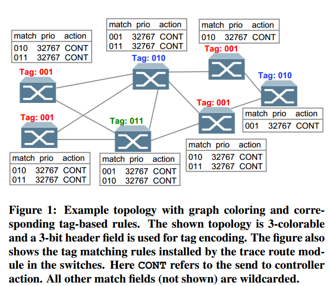
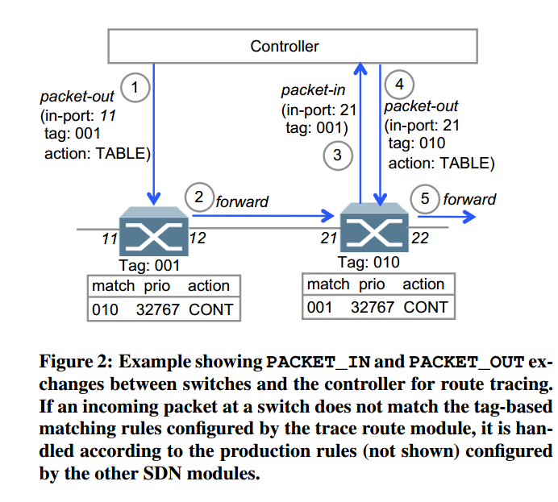

---
typora-copy-images-to:./
---
# SDN traceroute: Tracing SDN Forwarding without Changing Network Behavior

@HotSDN'14
[TOC]

## Motivation
- Flexibility in SDN brings added complexity, which requires new debugging tools that can provide insights into network behavior.
- SDN programs and controllers often translate **high-level configurations** into **low-level rules**. The result is that it can be difficult for network operators to **predict** the exact low-level rules.
- It is imperative to have tools that can provide visibility into how different packets are handle by the network at any given time.
- The main limitation of $traceroute$ is it can only provide the *layer-3 (IP)* path information because it relies on the time-to-live (TTL) field in the IP header to trigger ICMP error messages from intermediate routers.

## Problem Statement 
- Goal: trace the path of a given packet using the actual forwarding rules in the networkm with as little impact on the network as possible. Requirements:
  > 1. Non-invasive: existing rules in forwarding tables should remain unchanged.
  > 2. Accurate: The existing forwarding rules should be applied directly to the probes as well as production traffic when measuring the behavior of a switch.
  > 3. Low resource consumption: Requiring only a small number of rules per switch and update those rules infrequently.
  > 4. Commodity hardware: This work can work on existing SDN protocols.
  > 5. Arbitrary traffic: It should be possible  to trace the path of any flow and even any given packet form within a flow.

- SDN traceroute runs as an application on an SDN controller so that it can push rules to the switches and listen to OpenFlow messages. It has access to the **topology of the network**.
  > *input*: an arbitrary Ethernet frame, an injection point in the form of a switch identifier and port. 
  > *output*: an ordered list of  $<switch_id, port>$ pairs corresponding to each hop encountered by the packet as it traversed the network.

## Solution
### Network Configuration

- SND traceroute must install rules that allow it to selectively **trap probes**.
  > 1. <u>matching</u> the incoming probe packet so the hop can be logged at the controller
  > 2. <u>not matching</u> the controller-returned probe as to forward the packet downstream.

- SDN traceroute firstly applys a graph coloring algorithm to the topology. 
  > 1. Colors will serve as tags that are an integral part of the rules
  > 2. The coloring algorithm assigns each switch a color that **no two adjacent switches are assigned same color**. （典型的图论中的染色问题）
  > 3. This problem in Graph Theory is an **NP-hard problem**,SDN traceroute uses a **greedy algorithm** to color the vertices.
  > 4. All traffic carries a color so that the switches can decide whether or not to send a probe to  the controller. (Using **VLAN priority field** as the tag)
  > 5. In general, many datacenter topologies use a hierarchical tree structure consisting of core, aggregation and ToR switches. Those topologies require only 2-bit tags as **trees are 2-colorable**.

- The number of rules installed in a switch depends on the number of colors used by its **adjacent switches**. In most scenarios, this rqeuires installing one or two *TCAM rules*, e.g.
  
- These rules need only be changed when the network topology changes.
### Conducting the Trace Route

- Initialize the injection point $(switch, port)$:   
  > 1. Use the API call
  > 2. the attachment point of the source host, which is looked up by source MAC or IP address.
  > 3. it looks up **the color of the ingress switch** and inserts the color into the header tag bit of the probe frame.
  > 4. SDN traceroute sends the probe to the ingress switch as the $PACKET\_OUT$ message with input port set to the injection point. The action of $PACKET\_OUT$ is set to $TABLE$. (**目的: 让switch在处理时将probe当作从input port中接收到来处理**)

- Running Steps:

###The Assumption in this problem
- These bits for tag must not be modified by any devices in the network. (e.g. Middleboxes)
- The bits must correspond to header field(s) that can be matched on using rules in the switches. (e.g. 12 matchable fields in OpenFlow 1.0)
- SDN traceoute reserves the **hightest priority rules**.

## Evaluation
- Five IBM RackSwitch G8264 OpenFlow-enabled switches connecting several comodity servers running Open vSwitch
- Implementation of SDN traceroute is a module for the Floodlight controller providing a REST API allowing a network operator to perform a trace route for an arbitrary packet. (600 LOC)
## Related Work
- ATPG
- NetSight
- Anteater
- Header Space Analysis (HSA)
- Veriflow
- Libra
- OFRewind