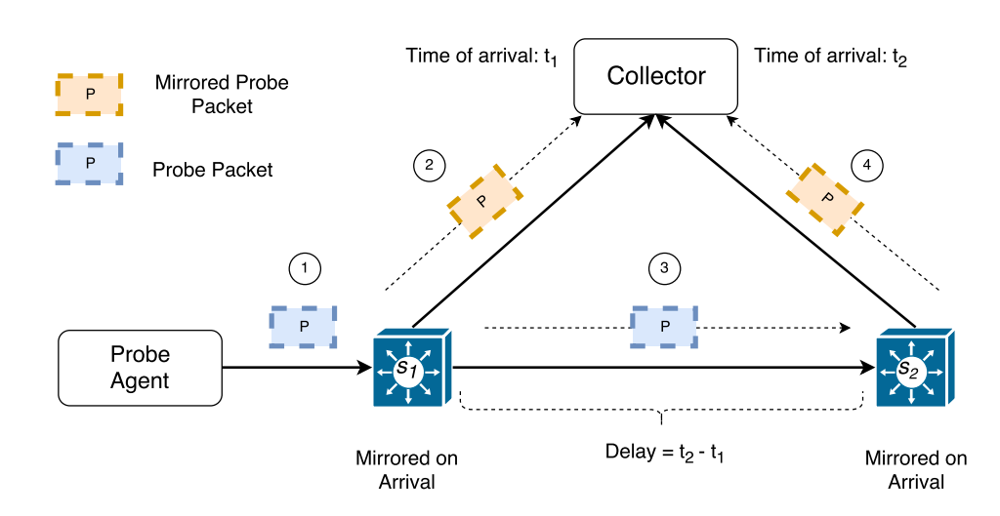
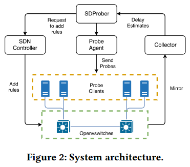
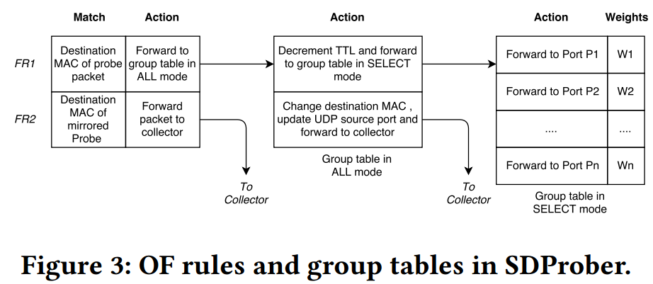

# SDProber: A Software Defined Prober for SDN
@SOSR'18

[TOC]

## Motivation
- **Persistent delays** in wide area networks are perilous and can adversely affect the effectivness of online service. (need to proactivly detect long delays as early as possible.)
- There is a trade-off between *detection time* and *cost* in proactive measurement of delays in SDN.
  > 1. Increasing the inspection rate of a link can reduce the detection time of a delay
  > 2. Inspecting a link too often could hinder traffic via that links or via the nodes it connects
  > 3. The limitation of the inspection rate per each link.
    > A lower bound: specify how often the link should be inspected.
    > An upper bound: restrict the number of inspecting per link.

- The frequency of congestion and high delays could be learned from the history and the inspection rates would be modified accordingly. (可以采用adaptive方法的原因) 
- Traditional tools (e.g. $ping$, $traceroute$) are unsuitable for adaptive measurement where different links should be inspected at **different rates**. (ping's predefined path limitation)
- SDN's central control over forwarding rules allows for efficient implementation of adaptable delay monitoring.
- Adaption is achieved by <u>changing the probabilities that govern the random walk.</u>
- SDProber is used for **proactive delay measurements** in SDN.
## Goal
- 1. inspect links at specified rates.
- 2. reduce the total number of probe packets when monitoring the network
- 3. minimize the number of excess packets through the links
- 4. detect delays earlt

## Problem Statement
### Model of Network and Delays
- Network is represented as a directed graph $G=(V, E)$ (normal model)
- The network operator specifies the minimum and maximum rates of probe-packet dispatching per link.
  > 1. **Input**: a network $G$, rate constraints on edges, a cost constraint $C$ that specifies the total probe packets per minute.
  > 2. **Objective**: probe $G$ that probe rates would satisfy the rate constrains and the cost constraint $C$.
- Computing a set of paths that satisfies the probe-rate constraints is complex, expensive in terms of running times (essentially, NP-hard), and inflexible.

  > if sending probes via predefined paths

### Overview of SDProber
#### Delay Measurement
- The delay between two given nodes $s_1$ and $s_2$ is measured by SDProber using probe packets. The schematic representation of the process is shown below:

- $t_1^{\leftrightarrow}$ and $t_2^{\leftrightarrow}$ are the round trip times between the nodes $s_1$ and $s_2$ and the collector. (can be easily measured by $ping$).
  > $t_1^{\rightarrow}$ and $t_2^{\rightarrow}$ be the one-way trip times from the node $s_1$ and $s_2$ to the collector
  > $t_2-t_1 \leq delay(s_1, s_2)+t_2^{\rightarrow} \leq delay(s_1, s_2)+t_2^{\leftrightarrow}$
  > $t_2-t_1 \geq delay(s_1, s_2)-t_1^{\rightarrow} \geq delay(s_1, s_2)-t_1^{\leftrightarrow}$ 
  > Result in: $t_2-t_1-t_2^{\leftrightarrow} \leq delay(s_1, s_2) \leq t_2-t_1+t_1^{\leftrightarrow}$

#### System Architecture
- SDProber sends probe packets repeatedly to measure delays in different parts of the network.

  > Collector collects mirrored packets to compute the expected delay per link or path.

- **Probe Agent**: It crafts and dispatches probe packets. In general, a probe client is attached to every node. And the number of probe clients can vary.

- Each probe has a **unique ID** in its payload and will be emitted from a **probe client.**
  > 1. Probe packets are marked to distinguish them from genuine traffic.
  > 2. The collector groups mirrored packets of different probes from one another. 

- **SDN Controller and Open vSwitch**: Underlying elements of the network are OVS with OpenFlow programming interface.
  > 1. SDProber routes probe packets in a **random walk fashion**.
  > 2. To achieve this, it uses a combination of **group tables** and **match-action rules**.
  > 3. OpenFlow's group tables are designed to execute <u>one or more buckets for a single match</u>
    > e.g. SDProber uses group tables in **ALL** (execute all the buckets) and **SELECT** (execute a selected bucket) modes.
  > 4. Each bucket has a weight, for each forwarded packet, the OVS choose a bucket and executes the actions in the bucket.
    > Each bucket contains a forwarding rule to a different neighbor node (a different port)
    > The buckets are selected arbitrarily. (e.g. per a hash of field values, in proportion to the weights.)
    > To add randomness to the bucket selection, the probe agent assigns a **unique source MAC address** to each probe packet. (In repeating visits at a node, the same actions are applied at each visit, 所以traversal是一个 **pseudo random walk**) 为啥？

- **Collector**: For each mirrored probe packets, collector records the **arrival time**, extracts the UDP source from the header and gets the **unique identifer** from the payload.
  > 1. Mirrored packets are grouped by the **identifier** of the probe.
  > 2. The number of groups should be equal to the total number of the probe packets.
  > 3. The number of packets in each group is equal to the **initial TTL limit**.
  > 4. After grouping, the collector computers the traversed path of each probe packet by ordering the mirrored packets of each group based on **DPID values of switches and the known network topology**.
  > 5. The recorded times of arrival of the ordered mirrored packets are used for estimating the delay for **each link** on the path. 

## Monitoring By Random Walk
- SDProber needs to satisfy the rate constraints when routing probes. Instead of computing a set  of path directly, the probe packets perform a random walk over a weighted graph.
  > 1. The initial node and each traversal step are selected randomly, per probe.
  > 2. The **link-selection probabilities** are proportional to **the weight of forwarding rules**.
  > 3. The length of path is limited by setting the TTL field. It determines the number of inspected links per probe packet.

- The model:
  > 1. $n$ is the number of nodes in the network $G$, each node $v_i \in V$ has a weight $w_i$.
  > 2. $W = \sum^{n}_{i=1}w_i$ is the sum of weights. 
  > 3. The probability of selecting node $v_i$ is $\frac{w_i}{W}$, For each selection of a node, a number $x$ in range $[0,1)$, $\frac{\sum^{i-1}_{j=1}w_j}{W} \leq x \leq \frac{\sum^{i}_{j=1}w_j}{W}$, $v_i$ is the selected node.
  > 4. For each probe packet forwarding, the link (port) for the next step is chosen **proportionally to the weights** assigned to forwarding rules. 

- To control the inspection rates:
  > 1. It needs to estimate the number of probes passing through each link for **a given number of emitted probes**.
    > + **First**, it computes visit probabilities for nodes. $P_0$ is a vector and $P_0[i]$ is the probabilities of selecting $v_i$ as the initial node, $1 \leq i \leq n$.
    > + The transition matrix of $G$ is an $n \times n$, $M=(p_{ij})_{1 \leq i,j \leq n}$, where $p_{ij}$ is the probability of forwarding the probe packet from $v_i$ to $v_j$
    > + For each node $v_i$, the array $(p_{i1},....,p_{in})$ specifies the probabilities for the next step after reaching $v_i$. If $v_i$ and $v_j$ are not neighbors, then $p_{ij} = 0$ and $\sum^{n}_{j=1} p_{ij}=1$, $v_i \in V$

- Given the initial probabilities vector $P_0$, $P_1 = (M^T) P_0$ is the vector of probabilities of reaching each node after one step.
  > 1. $P_t = (M^T)^tP_0$ denotes the probabilities of reaching each node after $t$ steps of the random walk. 
  > 2. The probabilities of the traversing a link $(v_i, v_j)$ in $k$ == The probabilities of reaching node $v_i$ in step $t$ and proceeding to node $v_j$ in step $t+1$, for some $0 \leq t < k$, it denotes this probability by $p-traverse_{ij}$.
  > 3. $p-traverse_{ij} = \sum^{k-1}_{t=0} (P_t)_i (p_{ij})$, **$(P_t)_i$ is the probability of reaching node $v_i$ at step $t$**, **$p_{ij}$ is the probability of forwarding to $v_j$ a packet that arrived at $v_i$.** 

- Why using random walk: In random walk approach, they do not conduct **complex computations** to craft probe packets or change them as they traverse the graph.

  > If network changes require **adjustments** of probe rates, they merely <u>alter the node weights of the intial node selection</u> or <u>alter the weights in the group tables</u>.

## Weight Adaptation
- Weights affects the random walk are adjusted to aid satisfying the rate constraints.
  > 1. SDProber modifies the weights iteratively using **binary exponential backoof**
  > 2. The iterations continue indefinitely as long as the monitoring continues.

- **Link-weight adaptation**: Weights are doubled (halved) when the probing rate is below (above) the minimum (maximum) rate.
  > 1. Rates within the limits specified by the rate constraints are adjusted after each iteration.
  > 2. Historically delayed links could receive **a higher weight** than links with no history of delays, to be visited more frequently. (通过调整迭代系数控制)

- **Node-weight adaptation**: Node weights are modified to reflect changes in links. 

  > 1. The weight of a node with a link below the minimum rate is doubled, to increase the chances of visiting it in the next iteration.

## Baseline Method
- Prober packets are sent via the **shortest path** between two selected nodes. There are two baseline method:
  > 1. **Random Pair Selection (RPS)**: In each iteration, pairs of source and destination nodes are selected randomly. In each iteration, the pair of source and destination nodes is selected uniformly from **the set of pairs that have not been selected previously**, <u>till all the links are probed</u>.
  > 2. **Greedy Path Selection**: In each iteration, for each of nodes, the $weight$ of the shortest path $P$ between these nodes is $\sum_{e \in P, e \notin Visited}min-rate(e)$, the sum of the min-rate values of all the unvisited links on the path.
    > The path with the maximal weight is selected and its links are added to $Visited$.

## Evaluation
- Mininet, OpenVSwitch 2.7.2, RYU controller, publicly-available real topology (196 nodes and 243 links)
- 实验内容：Detection Time, Cost Effectiveness, Adjusting $\alpha$

## Related Work
### Utilizing mirroring for measurements
- **NetSight** uses mirroring to gather information about the trajectories of all the packets in a network. (does not scale)
- **Everflow** provides a scalable **sampling of packets** in datacenter networks. (it requires specific hardware)

### Using Probe Packet
- **SLAM** uses the time of arrival of OpenFlow **packetin messages** at the controller to estimate the delay between links. (It is only relevant to datacenter traffic where there are enough packetin message generated)
- **OpenNetMon** provides per-flow metrics (e.g. throughput, delayu and packet loss) for OpenFlow networks. 