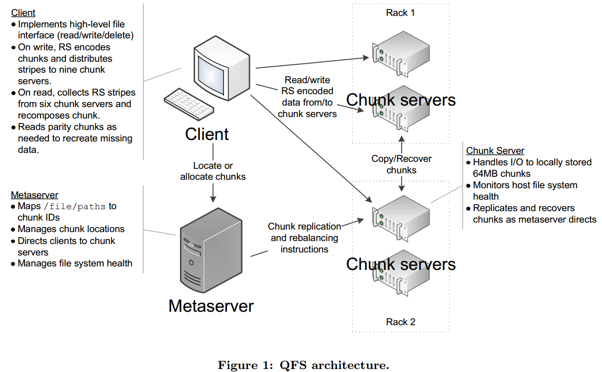
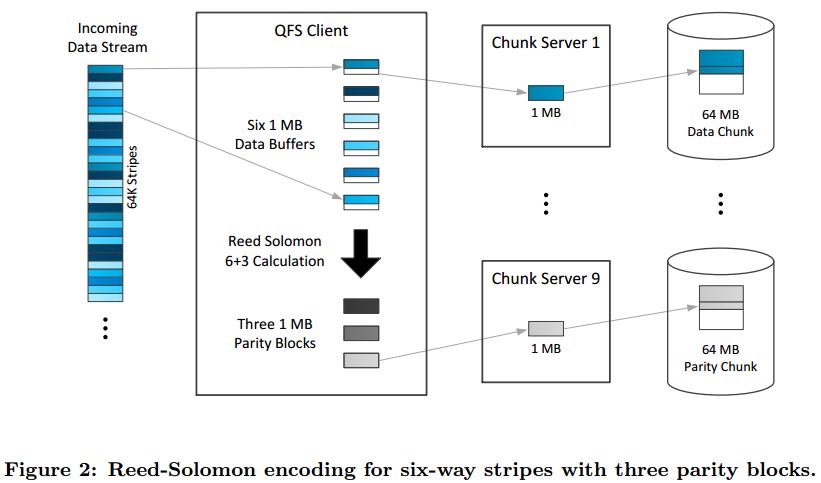

# The Quantcast File System
@VLDB2013
[TOC]

##1. Background and Motivation
- The QFS is an efficient alternative to the Hadoop Distributed File System (HDFS), written in C++. It offers several efficiency improvements relative to HDFS:
  > 1. 50% dish space savings through **erasure coding** instead od replication
  > 2. a resulting doubling of **write throughput** 
  > 3. a faster name node
  > 4. support for faster sorting and logging through a concurrent append feature
  > 5. a native command line client much faster than hadoop fs
  > 6. global feedback-directed I/O device management.

- Apache Hadoop maxized use of hardware by adopting a principle of **data locality**.
- To achieve fault tolerance, the HDFS adopted a sensible **3x replication strategy**.
  > store one copy of the data on the machine writing ir, another on the same rack, and a third on a distant rack.
  > Thus HDFS is not particularly <u>storage efficient.</u> 
    > At today's cost of $40,000 per PB. For reference, Amazon currently charges \$2.3 million to store 1 PB for three years.

- As these developments (e.g. high bandwidth network......), the QFS <u>**abandoned data locality**, relying on faster networks to deliver the data where it is needed, and instead optimized for storage efficiency.</u>

- QFS emplys **Reed-Solomom erasure coding** instead of three-way replication which delivers comparable or better fault tolerance.
- QFS was developed on the frame of the **Kosmox FIle System** an open-source distributed file system architecturally similar to Hadoop's HDFS <u>but implemented in C++ rather than Java</u> and at an experimental level of maturity.

##2. QFS Architecture
- The basic design goal: 
  > It is intended for efficient **map-reduce-style** processing, where files are written once and read multiple time by **batch process**, rather than for random access or update operations.
  > The hardware will be **heterogeneous**, as clusters tend to be built in stages over time, and disk, machine and nework failures will be routine.

- Data is physically stored in **64MB chunks**, which are accessed via **chunk server** running on the local machine.
- A single **metaserver** keeps an in-memory mapping of logical path names to <u>file IDs, file IDs to chunk IDs</u> and <u>chunk IDs to physical locations</u>.
- A **client library** which implements Hadoop's FileSystem interface and its equivalent in C++.

###2.1 Erasure Coding and Striping
- Erasure coding enables QFS not only to reduce the amount of storage but also to **accelerate large sequential write patterns** common to MapReduce workloads.
- Its our **proprietary MapReduce** implementation uses QFS not onlt for results but also for <u>intermediate sort spill files</u>.
  > Erasure coding is critical to getting these large jobs to run quickly while **tolerating hardware failures** without having to **re-execute** map tasks.

- A data stream is stored physically using **Reed-Solomon 6+3** encoding
  > The original data is striped over six chunks plus three parity chunks.

- **Write Data**: The QFS client collects data stripes, usually 64 KB each, into **six 1MB buffers**. When they fill, it calculates an additional three parity blocks and send all **nine blocks** to **nine different chunk servers** (<u>usually one lcoal and the other eight on different rack.</u>)

- **Read Data**: The client requests the six chunks holding original data
  > If one or more chunks cannot be retrieved, <u>the client will fetch enough parity data to execute the Reed-Solomon arithmetic and reconstruct the original</u>.

###2.2 Failure Groups
- *To maximize data availability*, a cluster must be partitioned into **failure groups**.
  > Each failure group represents machines with shared physical dependencies such as <u>power circuits or rack switches, which are therefore more likely to fail together.</u>
  > The metaserver will attempt to assign the nine chunks into **nine different failure groups**.
  > 

###2.3 Metaserver
- The QFS metaserver holds all the directory and file structure fo the file system, though **none of the data**. 
- For each file, it keeps the **list of chunks** that store the data and their **physical locations on the cluster**.
- It handles client requests
  > creates and mutates the direstory and file structure on their behalf.
  > refers client to chunk servers and manages the overall health of the file system.

- Metaserver holds all its data in RAM.
  > As client change files and directories, it records the changes atomically both in memory and to **a transcation log**
  > It forks periodically to dump **the whole file system image** into a checkpoint. 
  > 

####2.3.1 Chunk creation
- For **load balance**:
  > 1. Chunk servers continuously report to the metaserver the size of I/O queues and available space for each disk they manage.
  > 2. The metaserver <u>dynamcially decides where to allocate new chunks so as to keep disks evenly filled and evenly busy.</u>
  > 3. It **proactively** avoids disks with problems, <u>as they usually have large I/O queues.</u>

####2.3.2 Space Rebalancing and Re-replication
- QFS **rebalances** files continuously to maintain a predefined measure of balance across all devices.
  > The rebalance takes place when one or more disks fill up **over a ceiling threshold**, and moves chunks to devices with space utilization **below a floor threshlod**.
  > 

####2.3.3 Maintaining Redundancy
- A large cluster, **components are failing constantly**. The file system can be caught with **less redundancy** than it should have.
- The metaserver continuously monitors redundancy and recreates missing data.

####2.3.4 Evicting Chunks
- Eviction is a request to recreate a chunk server's data elsewhere so that its machine can be safely taken down.

####2.3.5 Hibernation
- For quick maintenance such as an operating system kernel upgrade, chunk are not **evicted**. Instead, the metaserver is told that chunk server directories are being **hinbernated**.
  > This will set **a 30-minute window** during which the metaserver will not attempt to replicate or recover the data on the servers being upgraded.

###2.4 Chunk server
- Each chunk server stores chunks as file on the **local file system**.
  > The chunk server accepts connections from clients to write and read data.

- It verifies **data integrity** on reads and initiates reconvery on permanent I/O errors or checksum mismatches.

###2.5 Interoperability
- QFS does not depend on Hadoop, though, and can be used in other contexts.
- The open-source distribution includes FUSE bindings, command-line tools, and C++/Java APIs.

##3. QFS Implementation
###3.1 Direct I/O for MapReduce Workloads
- By default QFS uses direct I/O rather than the system buffer cache, for several reasons
  > 1. It wanted to ensure that data is indeed written contiguously in large blocks.
  > 2. It wanted RAM usage to be predictable.
  > 3. The QFS metaserver makes chunk allocation decisions based on global knowledge of the queue sizes of all the I/O devices it manages.

###3.2 Scalable Concurrent Append 
- QFS implements *a concurrent append operation*, which scales up to tens of thousands of concurrent clients writing to the same file at once.

###3.3 Metaserver Optimization
- The metaserver represents the file system metadata in a **B+ tree** to minimize <u>minimize random memory access</u>.

###3.4 Client
- The QFS client library is designed to <u>allow concurrent I/O access to mulitple files from a single client</u>.
  > 1. **non-blocking**, **run-until-completion protocol state machines** for handling a variety of tasks.
  > 2. The state machine can be used directlu to create highly scalable applications.

- The QFS library API is implemented by **running the protocol state machines** in a dedicated protocol worker thread.
  > All file I/O processing including network I/O, checksumming, and recovery information calculation are performed within this thread.
  > 

- The file system meta information manipulations such as **move**, **rename**, **delete**, **stat**, or **list** require communication only with **the metaserver**.
  > These operations are **serialized** by the QFS client library and block the caller thread until the metaserver responds.

- The use of **read ahead** and **write behind** keeps disk and network I/O at a reasonable size.