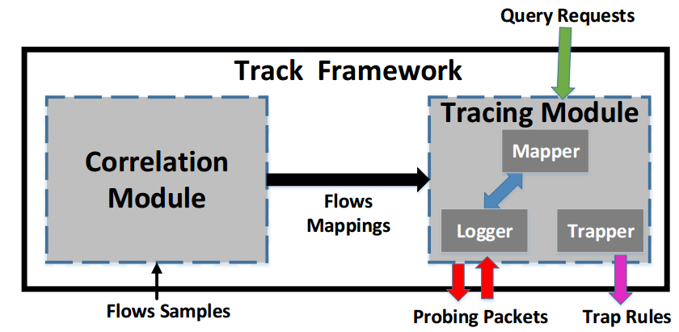
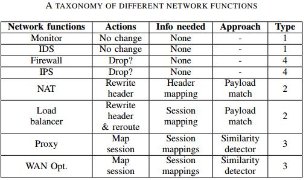
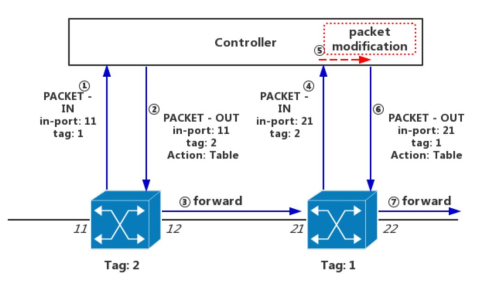

# Track: Tracerouting in SDN Networks with Arbitary Network Functions
@CloudNet'17
[TOC]

##1. Background and Motivation
- Existing path tracing tools largely utilize **packet tags** to probe network paths among SDN-enabled switches.
- **Ubiquitous Network Functions (NFs) ** or middleboxes can <u>drop packets or alter their tags</u> which can collapse the probing mechanism.
- Sending probing packets through network functions could **corrupt their internal states**, risking of correctness of servicing logic.
  > e.g. incorrect load balancing decisions

##2. Related Work
- 1. **SDN traceroute**: querying the current path taken by *any types of packet*.
  > SDN traceroute cannot work correctly in a network with network functions (or middleboxes) because some NFs, such as proxy and load balancer can modify packet headers and/or payload.

- 2. **SFC Path Trace**: it is able to trace paths consisting of NFs. However, it also relies on **tags probing packets**. It identifies the type of NFs that have forwarded tagged packets to the controller NFs through **looking up their device IDs from the predefined topology**. 
  > a. It will greatly limit its usability when a person has only partial or no access to the topology information.
  > b. sending probing packets through them may corrupt their internal states.

##3. Track
- The main idea: 
  >1. **Track** treat the whole path as <u>several sub-paths</u> joined by NFs. 
  >2. It injects a probing packet with user-defined header fields into networks to trace each sub-path.
  >3. It runs **a correlation procedure to infer behaviors of NFs** and concatenate all sub-paths in correct order according to correlation results. (eliminates the requirement of look-up of NF's ID from pre-defined topology information.)
    > This method uses a correlation procedure rather than sending probing packets through them, **preserving their internal states**.

###3.1 System Design and Implementation
####Design Principles: 
**Track** is a diagnosing tool for debugging in SDN environment with NFs. 
1. Do not corrupt NF states
2. Do not modify NF service logic
3. Do not modify production rules
- How about controller?
1. It knows the topology of a given network
2. the controller knows which switch has an NF attached to it (NF-switches)

####System Architecture

####Correlation Module:
1) NFs may drop the packet or dynamically modify its headers and contents. This paper roughly classify NFs into 4 types. 

2) Correlation Procedure: 
It treats NFs as **blackboxes** and infer their relevant **input-output** behaviors. (这里假设不去ask network administrators关于NF的信息)
It only need to reason about the NFs behaviors pertinent to packets' forwarding.
**WorkFlow**:
a. Collecting packets
b. Flow mapping
c. Calculate payload similarity
d. Identify the most similar flows

3) Implementation of the Correlation Module:
The controller **install rules** at NF-switches to retrieve the first few packets for each new flow.

####Tracing Module

1) Pre-installed rules: The rules must support two different tasks:
  > a) mathing the incoming probing packets so the hop can be logged at the controller (**similar to SDN traceroute**)
  > b) forwarding the controller returned probing packets as normal packets.

Track requires all probing packets to carry a tag so that switches can differentiate probing packets and normal packets. (这一点也是必须的)

2） Tracing procedure: 
1. Users need to <u>specify packet header (e.g. source/destination IP address, source/destination port and so on)</u>
2. Track constructs the packet with user specified packet header fields and tag
3. Identify the injection point which is the switch connected to the source specified by user.
4. Track **sends the probing packet to injection point**, it would be sent to the controller as **a PACKET_IN**.
5. If current hop is not an NF-switch, Track do the same operations as **SDN Traceroute**.
6. If current hop is an NF-switch, Track would modify the probing packet **as the NFs do** (according to the mappings) and preserve the probe tag.

Track only log down the information of PACKET_IN messages with probe tag.

3) Implementation of Tracing Module: 
Using the interfaces of RYU to construct probing packets.

##4. Experiment 
- Two metrics: **accuracy** and **latency**
Latency VS Path Length (Compared with SDN traceroute)
Latency VS Different types of NFs
Effectiveness and efficiency of **correlation procedure** (accuracy)

##4. The weakness in its method
1. Not consider the Dynamic Change in SFC
2. Need to find the correlation between incoming and outgoing flows
3. Cannot handle the case of multiple paths

