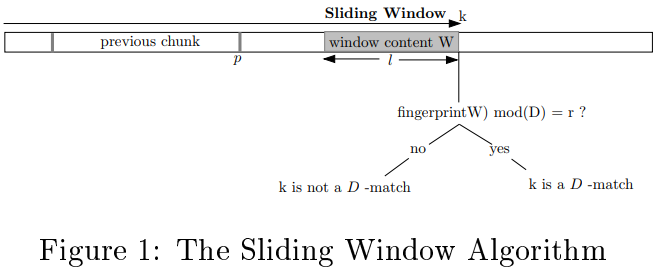

A Framework for Analyzing and Improving Content-Based Chunking Algorithms
------------------------------------------
|           Venue            |       Category       |
| :------------------------: | :------------------: |
| HP-TR'05 | Deduplication Chunking |
[TOC]

## 1. Summary
### Motivation of this paper
This paper proposes a framework to analyze the content-based chunking algorithms. And use this framework for the evaluation of the basic sliding window algorithm, and its two known variants.
> focus on **stateless chunking algorithm**, do not consider the history of the sequence, or the state of a server where other versions of the sequence might be stored.

**Chunking stability**: if it makes a small modification to data, turning into a new version, and apply the chunking algorithm to the new version of data
> most of the chunk created for the new version are identical to the chunks created for the older version data.

### Tow Thresholds, Two Divisors Algorithm (TTTD)
- Analysis on Basic Sliding Window Algorithm (BSW)
Basic workflow of the BSW:
there is a pre-determined integer $D$, a fixed width sliding windows is moved across the file, and at every position in the file.
> the content of this window are fingerprinted.
> Highly efficient fingerprint algorithm: e.g., Rabins fingerprint is used for this purpose.
> A position $k$ is declared to be a chunk boundary if there is a $D-match$ at $k$.

- The concept of fingerprint match
$S = s_1, s_2, ..., s_n$, a fingerprint function $h$ and a window length $l$, there is a $D-match$ at $k$ if, for some pre-determined $r \leq D$,

$$
h(W) \mod D = r, \text{where} (W = s_{k-l+1}, s_{k-l+2},....,s_k)
$$

> the property guarantees that BSW is stable under local modifications.

- The analytic framework 
It proposes a quantitiative framework for analyzing and comparing different chunking algorithms. 
> **modification overhead**: the number of bytes that need to be transferred not because they are new data, but because chunk boundaries.
> **modification index**: the normalization of the modification overhead by dividing it with mean chunk size.

### Implementation and Evaluation

## 2. Strength (Contributions of the paper)
1. This paper provides an analytic framework for evaluating and comparing chunking algorithms
> analyzing the basic sliding window chunking algorithm and two of its existing variants.

2. This paper also proposes a new chunking algorithm (TTTD) which performs much better than the existing algorithms.
> do some experiments to validate the superiority of TTTD based on a large collection of real files.

## 3. Weakness (Limitations of the paper)

## 4. Future Works
1. this paper mentions the point that it is very necessary to concern the size variation of chunks in chunking algorithm.