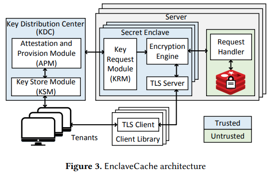

EnclaveCache: A Secure and Scalable Key-Value Cache in Multi-tenant Clouds using Intel SGX
------------------------------------------
|           Venue            |       Category       |
| :------------------------: | :------------------: |
| Middleware'19 | SGX Storage |
[TOC]

## 1. Summary
### Motivation of this paper
- Motivation 
  - In-memory key-value caches such as Redis and Memcached have been widely used to speed up web application and reduce the burden on backend database.
  - Data security is still a major concern, which affects the adoption of cloud caches (multi-tenant environment)
    - co-located malicious tenants 
    - the untrusted cloud provider
- Limitation of existing approaches 
  - virtualization and containerization technologies
    - achieved tenant isolation at the cost of system scalability, resource contention
  - adopt property-preserving encryption to enable query processing over encrypted data
    - suffer from high computation overhead and information leakage
- Threat model
  - multiple mutually distrust parties in a multi-tenant cloud environment
  - privileged adversary can access the data stored outside the trusted environment
  - malicious tenants may make spurious access to increase their cache hit rate, and evict the data of co-located tenants out of memory

### EnclaveCache

- Main idea
  - enforce data isolation among co-located tenants using multiple SGX
  - securely guard the encryption key of each tenant by the enclave
  - key question: how to utilize SGX enclaves to realize secure key-value caches within the limited trusted memory
    - remains an open question
- Key design decisions
  - tenant isolation
    - allow multiple tenants to share a single cache instance, and `each tenant gets a separate enclave as a secret container`
  - data protection
    - plaintext data only stays inside enclaves to get serialized, deserialized and processed, and the data is encrypted one it leaves the enclave.
- Cache isolation
  - application container: support un-modified applications inside enclaves (`bad scalability`)
    - e.g., SCONE
  - data container: hosting only each tenant's data in a dedicated enclave (`oversubscribe the SGX resources`)
  - secret container: storing only the sensitive information as well as the critical code into enclaves (`this paper design`)
- Architecture 
  - 
  - The TLS connection is terminated inside the enclave
  - **Encryption engine** inside then secret enclave is responsible for encrypting the sensitive fields of the requests passed from the TLS server endpoint.
  - The encryption key used by the encryption engine is acquired by the Key Request Module (KRM) from a Key Distribution Center (KDC).
    - via SGX remote attestation
- Key distribution and management
  - Each tenant is bound with a unique *encryption key* for the encryption/decryption of tenant's data stored outside the enclave.
  - Every newly-created secret enclave has to go through RA procedure to be attested and provisioned
    - the encryption key can be stored securely and persistently in the local disk
      - SGX sealing mechanism
- Query processing
  - only the sensitive fields of a message, such as the key/value field, need to be protected via encryption.
    - the IV for encryption is computed from the SHA-256 hash of each sensitive field
    - the IV and the MAC is appended to the ciphertext to be used at the time of decryption
  - bind the key and value
    - appends the hash of the key to its corresponding value, and the encryption is then performed on the newly generated value 
      - to against the attacher to replace the encrypted value.
  - query with the encrypted key 
    - forward to the request handler

### Implementation and Evaluation
- Implementation
  - mbedtls-sgx: AES-128, SHA-256
  - Tenant isolation
    - per-tenant LRU for shared multi-tenant cache management strategy
      - the same account of data is bound to be evicted from each tenant
    - bind each tenant with a logical database to enable the per-tenant LRU strategy
  - switchless call to optimize the performance

- Evaluation 
  - four instances: redis + stunnel, EnclaveCache + switchless, EnclaveCache, Graphene-SGX + redis
  - YCSB benchmark suite
  - 1. throughput
  - 2. hotspots analysis
    - using Intel VTune amplifier
  - 3. latency
    - for requests with large values, the performance of it decreases greatly, mainly due to the increased computation overhead for cryptography operations
  - 4. scalability
  - 5. cache fairness

## 2. Strength (Contributions of the paper)

- leverage trusted hardware to solve the problem of **tenant isolation** and **data protection** in multi-tenant clouds.
- adopts fine-grained, tenant-specific key-value encryption in SGX enclaves to `overcome the limit of SGX`.
- Extensive evaluation
  - better performance, higher scalability than running native, unmodified applications in the enclaves

## 3. Weakness (Limitations of the paper)

- Issues of encrypted data stored outside the enclaves
  - malicious adversaries can delete or re-insert previous key-value pair 
  - the operation types, key access frequencies and hashed-key distributions are also visible and exploitable.

## 4. Some Insights (Future work)

- Security issues in multi-tenants environment 
  - the multi-tenant environment may expose users' sensitive data to the other co-located, possibly malicious tenants
  - the cloud platform provider itself cannot be considered trusted
- SGX attach surface
  - the attack surface with SGX enclaves is significantly reduced to only the `processor` and `the software inside enclaves`.