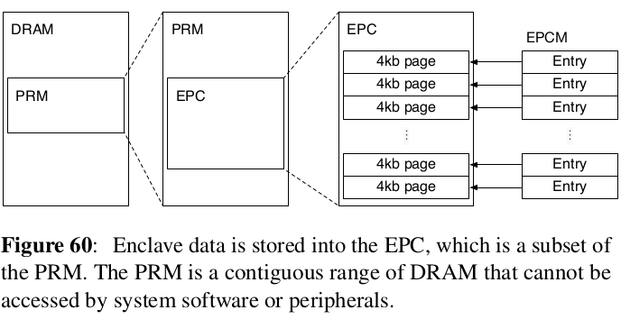
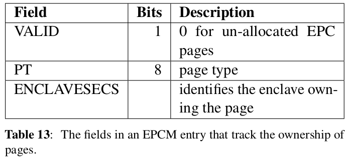
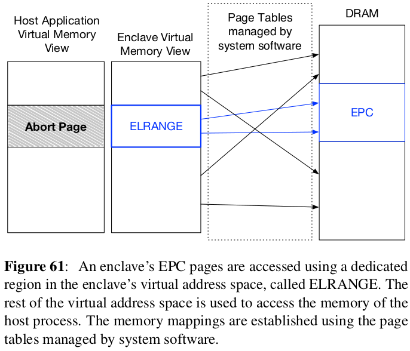

Intel SGX Explained
------------------------------------------
|           Venue            |       Category       |
| :------------------------: | :------------------: |
| IACR'16 | SGX |
[TOC]

## 1. Overview
- The root problem (confidentiality and integrity)
  - Secure remote computation: executing software on a remote computer **owned and maintained by an untrusted party**.
  - leveraging trusted hardware inn the remote computer
  - relies on **software attestation** 
    - prove to a **user** that he is communicating with a specific piece of software running in a secure container hosted by the trusted hardware.
    - Proof is a signature that certifies the hash of the secure container's contents. 

- Enclave 
  - Secure container
    - contains the private data in a computation
    - the code that operates on that data 

## 2. SGX programming model
### 2.1 SGX Physical Memory Organization
- Processor Reserved Memory (PRM)
  - PRM is a subset of DRAM that cannot be directly accessed by other software.
  - CPU's integrated memory controllers also reject DMA transfers targeting the PRM.
  -  

- Enclave Page Cache (EPC)
  - Since a system can have multiple enclaves on a system at the same time, the EPC is split into 4KB pages that can be assigned to different enclaves.
  - the same page size as the architecture's address translation feature.
  - the EPC is managed by the same system software that manages the rest of the computer's physical memory
    - a hypervisor or an OS kernel uses **SGX instructions** to allocate unused pages 
  - Most EPC pages are initialized by copying data from a non-PRM memory page. 

- Enclave Page Cache Map (EPCM)
  - As the system software is not trusted, SGX processors check the correctness of the system software's allocation decisions.
  - SGX records some information about the system software's allocation decisions for each EPC page in EPCM (store in "trusted memory")
  - 
    - page type:
      - PT_REG (regular type): enclave's code and data
      - PT_SECS (SGX Enclave Control Structures): store per-enclave metadata 

### 2.2 The memory layout of an SGX enclave
Describe the interaction between enclaves and non-enclave software

- The Enclave Linear Address Range (ELRANGE)
  - Each enclave designates an area in its **virtual address space**, call (ELRANGE)
    - map the code and sensitive data stored in the enclave's EPC pages
    - the virtual address space outside ELRANG is mapped to access non-EPC memory via the same virtual address.
  -   
  - when an enclave represents a **dynamic library**, it is natural to set ELRANGE to the memory range reserved for the library by the loader.

## 3. Enclave Programming
- Several terms need to be clarified
  - ECALL: "Enclave Call", a call made into an interface function within the enclave
  - OCALL: "Out Call", a call made from within the enclave to the outside application
  - Trusted Thread Context: the context for a thread running inside the enclave 
    - Thread control structure (TCS)
    - Thread data/thread local storage: data within the enclave and specific to the thread.
    - State save area: a data buffer which holds register state when an enclave must exit due to an interrupt or exception.
    - Stack: a stack located within the enclave  

- General design approach
  - identify the application's secret
  - identify the providers and consumers of those secrets 
  - determine the enclave boundary
  - tailor the application components for the enclave

### 3.1 Enclave definition language (EDL)
An enclave must expose an API for untrusted code to call in (ECALLs) and express what functions provided by the untrusted code are needed (OCALLs).
> both ECALLs and OCALLs are defined by developers using EDL, they consist the enclave boundary.

- EDL syntax
  - An enclave's bridge functions
    - ECALLs are prototyped in the trusted section, and OCALLs are prototyped in the untrusted section.
    - the *Edger8r* tool that is included with the Intel SGX SDK parses the EDL file and generates a series of **proxy functions**.
    - these proxy functions are wrappers around the real functions that are prototyped in the EDL.
  - Each ECALL and OCALL gets a pair of proxy functions (a trusted half and untrusted half)
    - trusted proxy functions: $EnclaveName$\_t.h and $EnclaveName$\_t.c
    - untrusted proxy functions: $EnclaveName$\_u.h and $EnclaveName$\_u.c 
```c++
enclave {
    // Include files
    // Import other edl files
    // Data structure declarations to be used as parameters of the function prototypes in edl

    trusted {
        // Include file if any. It will be inserted in the trusted header file (enclave_t.h)
        // Trusted function prototypes (ECALLs)
    };

    untrusted {
        // Include file if any. It will be inserted in the untrusted header file (enclave_u.h)
        // Untrusted function prototypes (OCALLs)
    };
};
```

- The proxy functions are responsible for:
  - Marshaling data into and out of the enclave
  - Placing the return value of the real ECALL or OCALL in an address referenced by a pointer parameter
  - Returning the success of failure of the ECALL and OCALL itself as an "sgx_status_t" value. 


- ECALL and OCALL processes
  - Program does not call the ECALL and OCALL function **directly**.
  - make an ECALL: 
    - call the untrusted proxy function for the ECALL, which in turn calls the trusted proxy function inside the enclave.
    - that proxy then calls the "real" ECALL and the return value propagates back to the untrusted function.


- The process to build a enclave program
  - write the Enclave Definition Language (EDL)
  - write the application that uses the enclave
    - define the global enclave id 
    - As it is in the untrusted application, we must include "sgx_urts.h"
      - include: "sgx_create_enclave" function, officially initialize the enclave instance.
      - include: "sgx_destroy_enclave()" function, destroy the targeted enclave.
    - also include "Enclave_u.h", which will include all of the ECALL proxies generated from the EDL file after compilation
  - define the functions which should be put in enclave (e.g., in "Enclave.h") 
    - put those functions in the trusted section of "Enclave.edl"

