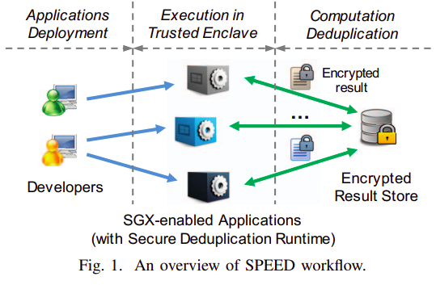

SPEED: Accelerating Enclave Applications via Secure Deduplication
------------------------------------------
|           Venue            |       Category       |
| :------------------------: | :------------------: |
| ICDCS'19 | Computation Deduplication |
[TOC]

## 1. Summary
### Motivation of this paper
- Motivation
redundant computatuibs occur commonly among several applications when handling the same input data.
> while the system-level optimizations may work effectively, there remains a need to further accelerate these applications from a new angle.
> eliminating redundant computations appeared in some enclave applications. (**repeated input data**).

It is crucial to *cache and reuse* the results of previous computations whenever possible.

**Main Idea** of computation deduplication:
check if a function call with the same (or similar) input data has been done before and the result can be directly obtained without *re-execution*.

### Method Name
- Assumption:
a particular computation is **deterministic** yet **time-consuming**.
> it would be more efficient to cache and reuse the same result rather than re-computing it.

### Implementation and Evaluation

## 2. Strength (Contributions of the paper)
1. propose the first secure and generic computation deduplication system SPEED.
> protect and reuse computation results across multiple applications.

2. implement a fully functional prototype with Intel SGX SDK.

## 3. Weakness (Limitations of the paper)

## 4. Some Insights (Future work)

