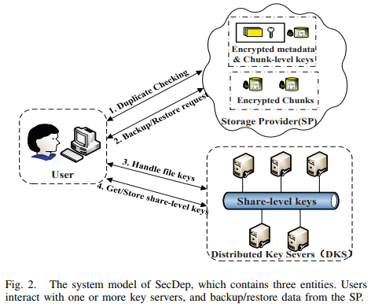
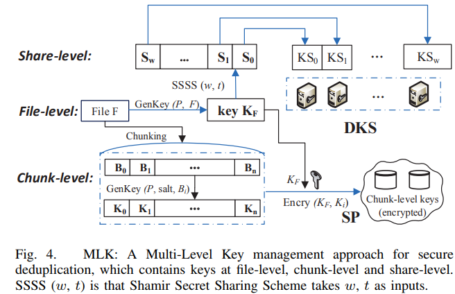

SecDep: A User-Aware Efficient Fine-Grained Secure Deduplication Scheme with Multi-Level Key Management
------------------------------------------
|  Venue  |       Category       |
| :-----: | :------------------: |
| MSST'15 | Secure Deduplication |
[TOC]

## 1. Summary
### Motivation of this paper
Convergent encryption suffers brute-force attacks or incurs large computation overheads.
> 1. deterministic and keyless issues.
> 2. for chunk-level deduplication: each chunk performs the time-consuming RSA-OPRF protocol to generate message-locked key. (incur significant computation overhead)

Existing key management approaches of convergent encryption incur 
> 1. large key space overhead
> 2. single-point-of-failure

This paper proposes the SecDeup which exploits redundant data distribution among and inside users, and use variants of CE to make a trade-off between **data security and duplicate detection performance**.

**Key Observation**
1. Cross-user redundant data are mainly from the duplicate files. Inside-user redundant data are mainly from the duplicate chunks.
2. Cross-user level deduplication and inside-user deduplication schemes face different security challenges.
> Cross-user level deduplication: high overhead.

### SecDep
- Key Idea
Instead of using global chunk-level deduplication, SecDep combines cross-user file-level and inside-user chunk-level secure deduplication to eliminate more redundant data.
> file-level deduplication: server-aided hash convergent encryption 
> chunk-level deduplication: user-aided convergent encryption
> cross-user file-level and inside-user chunk-level deduplication

- System Model

- Threat Model
Mainly focus on internal adversaries which can 
> 1. compromising the SP
> 2. colluding with users
> 3. stealing data from the DKS 

Security Goal
> 1. data confidentiality: the data copies are secure to 
> 2. security of keys:

- User-Aware Convergent Encryption (UACE) 

- Multi-Level Key Management
It includes three kinds of keys: file-level keys, chunk-level keys, share-level keys.

- Security analysis
Ensure **data confidentiality** and **key security**. Consider two types of adversaries:
> internal adversary (mainly focus on): 
> external adversary: could resist the external attacks by authentication.

1. security of data
> including data confidentiality and integrity 

2. security of keys
> distribute keys in several key servers by using the known SSSS (secret sharing).

3. security of SecDep
**Best case**: the adversary only compromise the SP, but cannot access to DKS
> the adversary cannot know the content of other users data even if it can perform brute-force attacks.

**Semi-best case**: the adversary has compromisd, and can access to DKS
> SecDep can ensure data security, the adversary cannot break the encryption key due to not knowing the user's secret.

**Worst casr**: the adversary obtains some users' secrets 
> SecDep can still ensure security for unpredictable data that are not falling into a known set. 

### Implementation and Evaluation
- Evaluation
Compare with:
> Baseline: without any security mechanisms.
> DupLESS-chunk: chunk-level DupLESS
> DupLESS-file: file-level DupLESS
> SecDep

Dataset:
> 1. synthetic dataset:
> 2. real-word datasets: 

1. Sensitivity study on size & number of files
2. Sensitivity study on average chunk size
3. 

## 2. Strength (Contributions of the paper)
1. A modified version of CE: user-aware convergent encryption (UACE) approach to resist brute-force attack and reduce time overhead.
2. Multi-level key management (MLK): ensure key security and reduce key space overheads.

3. This paper considers the issue of the key space overhead
> rarely to consider in other papers

## 3. Weakness (Limitations of the paper)
1. This paper intends to only eliminate duplicate files across different users, but it can only obtain the storage saving of majority of duplicate data.
> incur the loss of dedup factor compared with (2.8-7.35%)

## 4. Future Works
1. This paper gives a good summary of state-of-art secure deduplication schemes.

2. RSA-OPRF protocol is time-consuming
> will incur huge computation and time overheads for chunk-level deduplication.
> Large number of chunks incur hugh computation overheads

3. This paper argues suggests that cross-user redundant data are mainly from duplicate files.