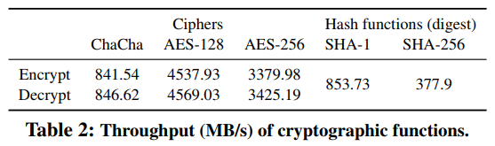

How to Best Share a Big Secret
------------------------------------------
|  Venue  |       Category       |
| :-----: | :------------------: |
| SYSTOR'18 | Secure Deduplication |
[TOC]

## 1. Summary
### Motivation of this paper
Each data-protection approach offers different tradeoffs and security guarantees. And it is difficult to compare them and determine which approach will provide the best application-perceived performance.
This paper intends to present the first end-to-end comparison of state-of-art encryption-based and secret sharing data protection approaches.

> the bottleneck of data protection shifts from the computational overhead of encoding and random data generation $\rightarrow$ storage and network bandwidth and global availability.

### How to best share a big secret

- Encrypt files at the client side
Key-based encryption: (provide computational security)
> encryption is considered computational expensive.

- Secret sharing: (cloud of clouds, provide information-theoretic security)
> combines the user's original data with redundant random data
> the original data can only be decoded by obtaining all of the encoded pieces.
> Without requiring maintenance of encryption keys.
> Drawback: generate a large amount of random data.

- To eliminate two major bottlenecks of data protection
> Secure RAID: computational overhead is comparable to that of erasure coding.
> Hardware cryptographic libraries.

- Evaluate all stages of the data path:
> Random data generation 
> Encoding and encryption overheads
> Overall throughput

- For computational overheads
Consider:
> Reed-Solomon
> Encryption
> AONT-RS
> Shamir's secret-sharingf scheme
> Secure RAID

Aim: identify the bottlenecks of the different data protection schemes with respect to their **computational overheads**.
Setting: single machine (single thread throughput)
Measure the throughput from 4 aspects: encode, stripe decode, degarded read, random access. 

- For End-To-End Evaluation
Aim: to understand the effect of the various **system-level** parameters on the bottlenecks.
Setting: multi-cloud (EC2), a distributed object store prototype. re-implement all schemes in Java.
> Write
> Object read
> Degraded read 
> Random read

### Implementation and Evaluation

## 2. Strength (Contributions of the paper)

## 3. Weakness (Limitations of the paper)

## 4. Future Works
1. This work mentions information-theoretical security is infeasible in real system implementations
> high cost of true random data generation.

2. The bottleneck in real implementations shifts from 
> 1. computational complexity 
> 2. storage throughput (on local storage)
> 3. network bandwidth (in cloud deployments)

3. This paper also suggests that encrypting the data and dispersing the keys with an efficient secret sharing scheme is optimal for multi-cloud environments
