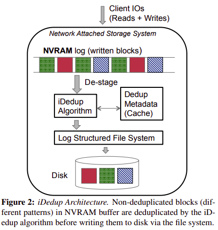

iDedup: Latency-aware, Inline Data Deduplication for Primary Storage
------------------------------------------
|           Venue            |       Category       |
| :------------------------: | :------------------: |
| FAST'12 | Deduplication System |
[TOC]

## 1. Summary
### Motivation of this paper
- Motivation
Many primary storage workloads are unable to leverage the benefits of deduplication 
> due to the associated latency costs.

Prior research has not applied deduplication techniques **inline** to the request path for **latency sensitive**, **primary workloads**.
> inline deduplication: add work to the write path, increase latency
> offline deduplication: wait for system idle time to do deduplication.
> reads remain fragmented in both.

- Disadvantages of offline deduplication
  - cause a bloat in storage usage leading to inaccurate space accounting and provisioning
  - need system idle time to perform deduplication without impacting foreground requests.
  - offline deduplication uses extra disk bandwidth when reading in the staged data.

- Current workloads have two insights:
> 1. spatial locality
> 2. temporal locality

Key question: how to do the tradeoff between capacity savings and deduplication performance？

### iDedup
- Goal: not increase the latency of the already latency sensitive, foreground operations.
1. read operation: fragmentation in data layout.
2. write operation: to identify duplicates, on-disk data structures are accessed.

- Main idea
1. Amortize the seeks caused by deduplication by only performing deduplication when a sequence of on-disk blocks are duplicated.
> examine blocks at write time
> configure a *minimum sequence length*
> tradeoff: capacity savings and performance

2. maintain an in-memory fingerprint cache to detect duplicates in lieu of any on-disk structures.
> a completely memory-resident, LRU cache.
> tradeoff: performance (hit rate) and capacity savings (dedup-metadata size)

- Design rationale
1. *Spatial locality* in the data workloads
Duplicated data is clustered.

2. *Temporal locality* in the data workloads
making the fingerprint table amenable to caching

- System Architecture

1. Cache design
One entry per block.
> maps the fingerprint of a block to its disk block number (DBN) on disk.
> use LRU policy, (fingerprint, DBN)

2. Metadata management
In RAM:
> Dedup-metadata cache: a pool of block entries (content-nodes)
> Fingerprint hash table: maps fingerprint to DBN
> DBN hash table: map DBN to its content-node.

In disk
> Reference count file: maintains reference counts of deduplicated file system blocks in a file.
>
> > refcount updates are often collocated to the same disk blocks (thereby amortizing IOs to the refcount file)

3. iDedup algorithm: Sequence identification

### Implementation and Evaluation

- Evaluation
Two tunable parameters: 
> 1. the minimum duplicate sequence threshold 
> 2. in-memory dedup-metadata cache size

Two comparisons:
1. baseline: without deduplication
2. threshold = 1: exact deduplication

1. Deduplication ratio vs. threshold
threshold increases, the deduplication ratio drops
2. Disk fragmentation vs. threshold
threshold increases, fragmentation decreases
3. client read response time vs. threshold
same trend as disk fragmentation
4. CPU utilization vs. threshold
utilization increases slightly with the threshold
iDedup algorithm has little impacts on the overall utilization 
5. Buffer cache hit rate vs. dedup-metadata cache size 

## 2. Strength (Contributions of the paper)

## 3. Weakness (Limitations of the paper)
1. This paper provides the insights on spatial and temporal locality of deduplicated data in real-world, primary workloads.

## 4. Some Insights (Future work)
1. This paper mentions that the higher the deduplication ratio, the higher the likelihood of fragmentation.
> deduplication can convert sequential reads from the application into random reads from storage.

2. It mentions the threshold in iDedup must be derived empirically to match the randomness in the workload.
> depends on the workload property
> how to enable the system to automatically make this tradeoff.

3. primary storage system trace
CIFS traces: NetApp (USENIX ATC'08)