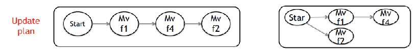

周报8   吴慧   2018.10.28

本周工作

1. 本周主要看了Catalyst这篇文章，该paper的问题和我们要做的问题背景是一样的，基于Straggler交换机的存在考虑更快的更新，转换思路改变了目标状态，使得某些流不经过这类Straggler交换机。
2. 复习ai考试；

下周安排

整理读过的文章，做一个PPT汇报，总结已有方法的问题和缺陷，针对这些缺陷最好给出example，解决问题的基本idea。先讲清楚人家的方法和思路，再简要说一下我的idea。

# Catalyst: Unlocking the Power of Choice to Speed up Network Updates

@CoNEXT'17 @update with solving straggler switch
[TOC]

## Summary
***Motivation of this paper***:

- 已有的更新方法，目标状态不可变，更新中遇到straggler switch会使得更新变慢 

- 数据中心存在冗余的备份路径可用

  > Furthermore, we observe that because of the prevalence of switch stragglers—switches that unexpectedly take longer time to update, simply assigning a flow to a single (shortest) path is not an optimal design as even a single switch straggler can substantially increase the update time. 
  >
  > We observe that because networks are typically provisioned with redundancy, there are multiple near-optimal paths to place a flow. 

***Method***

Key idea1:

假设target state可变，利用冗余的备份路径来避开straggler switch，合并基于依赖图的更新stages来完成更快速的网络更新。

stage: 在同一时间并行更新的操作集合，stages之间需满足依赖关系。

> Based on the dependencies, these approaches construct a dependency graph, where each stage consists of a set of updates that can be applied in parallel, whereas updates in one stage cannot be started until all operations in the prior stages have completed.

Key idea 2:

在run-time时，针对单条流选择多条路径并行更新来避开Straggler交换机。

***Implementation and Evaluation***:

## Strength (Contributions of the paper)

- 首次提出目标状态可变的思路，考虑了straggler switch对更新时间的影响；
- 针对一条流，考虑计算另外的可选路径，从而达到合并更新状态的目的，进而减少更新时间
- 考虑了在run-time的情况下，如何选择更新路径，从而在update time和efficiency上做trade-off
- Using a load-balancer setting in a data center network to verify the CATALYST.

## Weakness (Limitations of the paper)

- 对冗余路径上的straggler switch定义不明确，对如何选择冗余路径以及选多少条路径来同时更新的算法没有描述；

## Future Works

- 提前预测straggler switch，在更新的时候不需要选择多条路径同时更新，减少开销；
- 改进选路径的算法，找到更合适的路径选择算法；