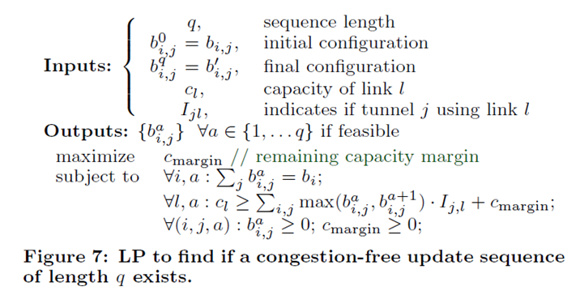

# Achieving High Utilization with Software-Driven WAN

@sigcomm 13

SWAN根据需求集中控制服务流量的大小和路径，重配置网络数据平面以提高数据中心间的网络利用率。具体负责基于需求和网络拓扑，决定每个服务发送多少流量，配置网络数据平面转发这些流量。可以只占用少量临时链路容量来应用congestion-free的更新，不需要对各个交换机的更新顺序和时间做任何假设。

基于数据中心之间的服务进行配置，所以基于性能需求总结了三种服务类型：

1. 交互式服务：出现在终端用户体验的关键路径上，如某用户的访问资源不在第一个DC，需要到第二个DC查找。丢包和时延敏感。
2. 弹性服务：不在用户体验的关键路径上，但也需要及时交付。例如数据中心的副本更新，可能遭遇故障导致数据丢失，或者用户看到不一致的数据等。
3. 后台服务进行维持和供应活动。如将服务的所有数据复制到另一个DC长存储存，或者移动到其他DC运行。需要大量带宽，占用资源，大流量。

### 资源分配：

线性规划（LP）+ 最大最小公平算法

启发式算法：寻找携带最大流量的给定大小的隧道集合（NP完全）

​		对DC对，先选择时延最小的隧道，然后选择能携带更多流量的隧道，并在不违反在交换机j上的规则数量m_j前提下重复加入更多的隧道。

### 更新转发状态：

- 改变已有隧道的流量分布

  网络配置定义
  $$
  C={b_{ij}:\forall(i,j)} \rightarrow C'={b'_{ij}:\forall(i,j)}
  $$
  找到C0=C0,...,CK=C'序列，Ci到Cj都是congestion-free的。通过链路预留的scratch容量可以解决部分无法找到可行解的资源分配。

  通过求解线性规划来得到长度为q的配置序列：最大化剩余容量

  

  

- 改变隧道集

$$
P \rightarrow P' (P=P_{1}=,...,=P_{K}=P')
$$

1. 先找到满足规则限制的隧道序列（这个计算是由控制器完成，集合计算）

2. 分配隧道应该携带的流量

3. 通知服务以隧道集中最小速率发送

4. 服务改变发送速率后10s，开始执行隧道改变Pi到Pi+1