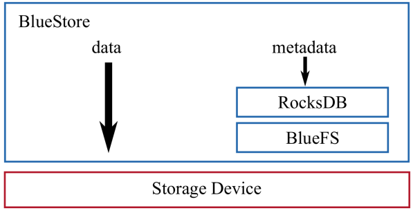
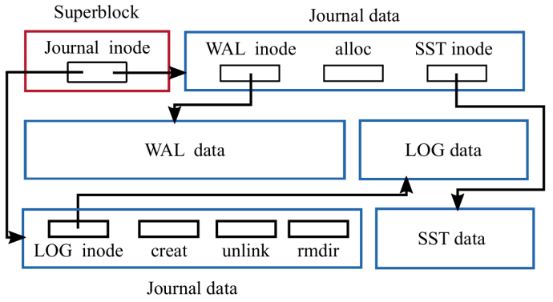

# File Systems Unfit as Distributed Storage Backends: Lessons from 10 Years of Ceph Evolution

|           Venue            |       Category       |
| :------------------------: | :------------------: |
| SOSP'19 | Ceph |
[TOC]

## 1. Summary
### Motivation of this paper

- motivation
  - developing a **zero-overhead transaction mechanism** in file systems is challenging
  - **metadata performance** at the local level affects performance at the distributed level
    - enumeration is necessary for operations like scrubbing, recovery, and listing objects
  - supporting for novel, backward-incompatible storage hardware (e.g., SMR, ZNS SSD)
    - **backward incompatible zone interface**
      - host-managed SMR drives: encourage a **log-structured, copy-on-write** design
      - Zoned namespaces (ZNS)
      - the zone interface requires a **copy-on-write** approach to data management
  - from FileStore to BlueStore
    - storing object data as files and running RocksDB on top of a journaling file system
      - introduce **high consistency overhead**
    - BlueStore uses raw disks
- other changes
  - without the complete control of the I/O stack, it is hard for distributed file systems to enforce storage latency SLOs
  - if the backing file system is not copy-on-write -> making snapshots and overwriting of erasure-coded data expensive

### BlueStore

- architecture
  - 

- BlueFS and RocksDB
  - fast metadata operations
    - store metadata in RocksDB
  - no consistency overhead for object writes
    - write data directly to raw disk -> one cache flush for data write
    - change RocksDB to reuse WAL file -> one cache flush for metadata write
  - BlueFS implements basic system calls required by RocksDB
    - e.g., open, mkdir, and pwrite
    - 
- data path and space allocation
  - copy-on-write clone operation
    - incoming writes **larger than** a minimum allocation size the data is written to a **newly allocated extent**
    - writes **smaller than** the minimum allocation size -> both data and metadata are first inserted to RocksDB, and then asynchronously written to disk after the transaction commits
  - no journaling double-writes
- cache
  - using direct I/O -> cannot leverage the OS page cache
  - implement its own write-through cache in user space
- checksum
  - compute a checksum for every write and verify the checksum on every read
- overwrite of erasure-coded data
  - perform overwrites in EC pools using **two-phase commit**
    - first, all OSDs that store a chunk of the EC object make a copy of the chunk -> can roll back in case of failure
    - second, all of the OSDs receive the new content and overwrite their chunks -> old copies are discarded
- transparent compression
  - compressing over large 128KiB chunks
  - use hints and simple heuristics to compress only those objects that are unlikely to experience many overwrites`
- exploring new interfaces
  - enable porting RocksDB and BlueFS to run on host-managed SMR devices

### Implementation and Evaluation

- evaluation
  - bare RADOS benchmarks
  - RADOS block device benchmarks
  - overwriting erasure-coded data

## 2. Strength (Contributions of the paper)

- outline the main reasons behind Ceph's decision to develop BlueStore
  - **user space storage backend** deployed directly on raw storage devices
  - efficient transactions
  - fast metadata operation
    - directories with millions of entries (ordering)
  - adopt SMR and ZNS SSD
- introduce the design of BlueStore, the challenges its design overcomes, and opportunities for future improvements
  - store low-level file system metadata in a key-value store
  - optimize clone operations and minimize the overhead of the resulting extent reference-counting through careful interface design
  - BlueFS: enable RocksDB to run faster on raw storage devices
  - space allocator: fixed memory usage per terabyte of disk space
- several experiments that evaluate the improvement of design changes
  - BlueStore v.s. FileStore

## 3. Weakness (Limitations of the paper)

- cache sizing and writeback
  - the cache size is a fixed configuration parameter that requires manual tuning
- key-value store efficiency
  - embedding RocksDB in BlueStore is problematic in multiple ways
    - compaction and high WA when using NVMe SSDs in OSDs
    - treat as a blockbox -> data is serialized and copied in and out of it -> consume CPU time
    - its own threading model -> limit the ability to do custom sharding
- CPU and memory efficiency
  - minimize data serialization-deserialization

## 4. Some Insights

- the storage backend plays a key role in the performance of the overall system
  - receive I/O requests over the network and serve them from locally attached storage devices using **storage backend** software
    - storage backend: ext4 or XFS used in traditional distributed file systems
- transaction support in the storage backend
  - most file systems implement the **POSIX** standard, which **lacks a transaction concept**
    - using inefficient or complex mechanisms
      - implementing a **Write-Ahead Log** (WAL)
      - leveraging a file system's **internal transaction mechanism**
- Ceph distributed storage system architecture
  - `librados` library provides a **transactional interface** form manipulating objects and object collections in RADOS
    - CephFS: a distributed file system with POSIX semantics
  - logical partitions (**pools**): provide redundancy for the contained objects either through replication and erasure coding
  - CRUSH: form an **indirection** layer between clients and OSDs
    - allow the migration of objects between OSDs to adapt to cluster or workload changes
  - a separate **Ceph OSD daemon** per local storage device
    - each OSD processes client I/O requests from librados clients and cooperates with peer OSDs to replicate or erasure code updates
    - ObjecStore interface
      - provide abstractions for objects, object collections, a set of primitives to inspect data, and **transactions** to update data
        - transactions: combines an arbitrary number of primitives operating on objects and object collections into an **atomic** operation
      - each OSD may make use of a **different** backend implementation of the ObjectStore interface
- provide transactions in a storage backend running on top of a file system
  - hooking into a **file system's internal (but limited) transaction mechanism**
    - lack of a rollback mechanism
    - hard to leverage the internal transaction mechanism of a file system in a storage backend implemented in user space
  - implementing a **WAL in user space**
    - **slow read-modify-write**
      - three steps
        - the transaction is serialized and written to the log
        - `fsync` is called to commit the transaction to disk
        - the operations specified in the transaction are applied to the file system
  
      - every read-modify-write operation incurred the full latency of the WAL commit
  
    - **non-idempotent** operations
      - replaying a logical WAL after a crash is challenging
    - **double writes**
      - data is written twice
        - first to the WAL and then to the file system
        - halving the disk bandwidth
      - lead to most file systems only **log metadata** changes, allowing **data loss** after a crash
  - using a **key-value database with transactions as a WAL**
    - the metadata was stored in RocksDB, while the object data were still represented as files in a file system
      - **metadata operations** could be performed **atomically**
    - introduce **high consistency overhead** that stems from running atop a journaling file system
      - similar to the **journaling of journal** problem
        - writing to a file and calling `fsync`
        - writing the object metadata to RocksDB synchronously -> also call `fsync`
      - `fsync` issues one expensive FLUSH CACHE command to disk
        - with a journaling file system, each `fsync` issues two flush commands
          - after writing the data
          - after committing the corresponding metadata changes to the file system journal

